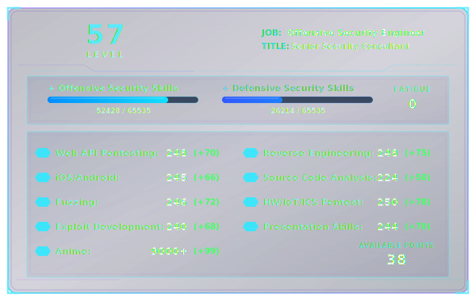

<!-- TOP SECTION: Profile Image + Stats Card side-by-side -->

<table align="center">
  <tr>
    <td align="center" width="38%">
      
    </td>
    <td align="center" width="62%">
      
    </td>
  </tr>
</table>

 

---

Hey there, welcome! I’m **0xdhanesh**. It’s a pleasure to meet you.

I’m always interested in discussing and collaborating on offensive and defensive security projects. Feel free to reach out using the contact options below.

### Currently Building

* [Igiris](https://github.com/0xdhanesh/Igiris) — An automation-focused offensive security project.
* [0xdhanesh Blog](https://0xdhanesh.github.io/) — Migrating older research and publishing new technical content.

### Issues I’m Contributing To

* [Raspberry Pi Imager](https://github.com/raspberrypi/rpi-imager/issues/1669)
* [Kali ARM](https://gitlab.com/kalilinux/build-scripts/kali-arm/-/work_items/343)

---

<!-- MIDDLE SECTION: Large Hero/Banner Image -->

  

---

<!-- ACHIEVEMENTS SECTION -->

## 🏆 Achievements

* **Professional Certifications:** OSCP, CREST CPSA, CREST CRT, Practical ICS Pentesting, and ICS/SCADA Protocol Traffic Analysis.
* **CVE-2022-2912:** Reported a server-side request forgery vulnerability affecting a WordPress plugin.
* **Oracle Security Recognition:** Reported an open-redirect vulnerability acknowledged in Oracle’s January 2022 advisory.
* **Product Security Leadership:** Built and led a four-member product security team delivering end-to-end assessments across more than 10 ICS products.
* **Enterprise Impact:** Identified a SharePoint ACL issue that exposed sensitive HR data belonging to more than 500 employees and helped drive remediation within three days.

---

<!-- DROP DOWN FOR COMMUNITY ITEMS -->

  
<b>👥 Community Contributions</b> — Click to expand

   

  <ul>
    <li>Trained more than 300 engineers in API security at Sony.</li>
    <li>Reached more than 150 security professionals through reverse-engineering and exploit-development workshops.</li>
    <li>Mentored an OWASP Active Directory Security workshop.</li>
    <li>Delivered talks on Attacking Active Directory and the Cybersecurity Consultant Journey.</li>
    <li>Presented at the Hardware Village at Seasides Goa 2026.</li>
    <li>Trained students using eTCHP course content.</li>
    <li>Curated internal training material for colleagues and interns covering web application penetration testing, network analysis, and reverse engineering.</li>
  </ul>

---

<!-- CONTACT OPTIONS -->

## 📬 Contact Options

  
  
  
  

